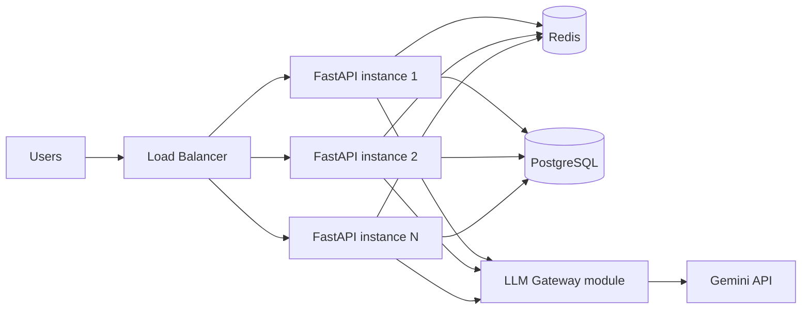

# Architecture & Design Decisions

## 1. System overview



- **FastAPI instances** are stateless — no in-memory session or cache. That's
  what makes it safe to run N of them behind a load balancer and scale
  horizontally without sticky sessions.
- **Redis** does double duty: response cache (identical questions within
  `CACHE_TTL_SECONDS` skip the LLM entirely) and a distributed rate limiter
  (a fixed-window counter per user, shared across every instance).
- **PostgreSQL** stores the durable audit trail (`chat_logs`): who asked what,
  latency, token usage, cache hit/miss, and status. This is what a real
  `/metrics`-adjacent reporting dashboard or billing system would query.
- **LLM Gateway** (`app/llm_client.py`) is the single choke point that talks
  to Gemini. Isolating it here is what lets a production version add
  provider fallback (e.g. Gemini → OpenAI) or a circuit breaker without
  touching any route.

---

## 2. Authentication, SSO/OIDC extension, and RBAC

**What's implemented:** `/auth/login` checks a demo credential and issues a
self-signed JWT (HS256, expiring after `ACCESS_TOKEN_EXPIRE_MINUTES`).
`/chat` and `/metrics` require a valid bearer token; `/metrics` additionally
requires the `admin` role via a `require_role()` dependency.

**Why this is a reasonable stand-in:** it exercises the full auth path
(issue → validate → authorize) without needing an external IdP for a
take-home assessment, and the JWT validation logic is exactly what stays in
place when a real IdP is introduced — only *who issues the token* changes.

**Extending to SSO/OIDC in production:**

```
Application → SSO / OAuth2 / OIDC → Identity Provider → JWT → API Gateway → AI Service
```

1. Replace `/auth/login` with a redirect into the IdP (Okta, Auth0, Azure AD,
   Keycloak) using the OAuth2 Authorization Code flow with PKCE.
2. The IdP authenticates the user and redirects back with an authorization
   code; the app exchanges it for an ID token (OIDC) and access token.
3. The API stops *minting* JWTs and instead *validates* IdP-issued JWTs on
   every request — fetching the IdP's JWKS (public keys) to verify the
   signature, and checking `iss`, `aud`, and `exp` claims. `python-jose`
   already used here supports JWKS-based verification with no library
   change.
4. An API Gateway (Kong, AWS API Gateway, or an Ingress with an auth plugin)
   can front the FastAPI instances and do this validation before traffic
   even reaches the app, offloading it from every replica.
5. Roles/groups come from the IdP's token claims (e.g. a `roles` or `groups`
   claim) instead of a hard-coded `DEMO_ROLE`, so `require_role()` keeps
   working unchanged — it just reads a claim that now originates externally.

**RBAC — role permissions:**

| Role | `/chat` | `/health` | `/metrics` | User/config management |
|---|---|---|---|---|
| Admin | ✅ | ✅ | ✅ | ✅ |
| User | ✅ | ✅ | ❌ | ❌ |
| Read-only | ❌ (or rate-limited read-only mode) | ✅ | ❌ | ❌ (view permitted reports only) |

This maps directly onto `require_role("admin")` / `require_role("user",
"admin")` dependencies — each route declares the roles it accepts, and the
same pattern extends to any new endpoint (e.g. a future `/admin/users`).

---

## 3. Scaling to 100–500 RPS

- **Horizontal scaling:** the app is stateless, so `docker-compose up --scale
  app=5` (or a Kubernetes Deployment with multiple replicas) is enough —
  no code changes.
- **Load balancing:** an ALB/NGINX/Kubernetes Service in front of the
  replicas distributes traffic and removes instances that fail `/health`
  checks (readiness/liveness probes).
- **Kubernetes HPA:** scale the Deployment on CPU/memory, or better, on a
  custom metric like requests-in-flight or `chat_request_latency_seconds`
  p95 exported via `/metrics`, so the app scales *before* latency degrades
  rather than after.
- **Redis:** two jobs — (1) cache repeated questions, cutting LLM calls
  directly under bursty/duplicate traffic, and (2) enforce a *global*
  per-user rate limit across all replicas (a local in-process limiter would
  under-count once you have more than one instance).
- **Background queues:** long-running or bulk LLM work (e.g. batch
  Q&A, document ingestion for RAG) should go through a queue (Celery/RQ on
  Redis, or SQS) instead of blocking a request thread — keeps `/chat`
  latency predictable under load.
- **Rate limiting:** protects both the app (`RATE_LIMIT_PER_MINUTE` per user,
  implemented) and the upstream LLM provider from being overwhelmed by a
  traffic spike or a single noisy client.
- **LLM API limits (RPM/TPM/concurrency):** Gemini's own rate limits are the
  real ceiling at 500 RPS. Mitigations: aggressive caching (implemented),
  a semaphore/connection-pool cap on concurrent outbound LLM calls per
  instance, and queuing overflow requests rather than rejecting them
  outright when nearing the provider's limit.
- **Concurrent requests:** FastAPI + Uvicorn workers handle concurrent I/O
  well since the google-genai SDK call is I/O-bound; running multiple Uvicorn
  workers per pod (or async client calls) increases per-instance throughput
  without adding replicas.
- **Failure recovery:** implemented in `llm_client.py` — exponential-backoff
  retries (via `tenacity`) on timeout/connection/rate-limit/5xx errors, and
  a safe fallback message returned instead of a 500 once retries are
  exhausted, so a degraded LLM provider degrades the *answer quality*, not
  the whole API.

---

## 4. Migrating a single EC2 app (10 users) to 10,000 users

**Current state:** one EC2 instance running everything; occasional
slowness/crashes under load, presumably from doing blocking LLM calls
synchronously on a single process with no cache, no retry logic, and no
separation between app and data tier.

**Target architecture:**

```
Users → Load Balancer → Kubernetes/ECS (FastAPI replicas) → Redis / Queue → LLM Gateway → LLM APIs
                                    |
                                PostgreSQL (managed, e.g. RDS)
```

- **Scaling the application:** move FastAPI into containers behind an
  ALB, running on ECS Fargate or EKS/Kubernetes so replica count scales
  with load (HPA or ECS service auto-scaling) instead of one fixed EC2 box.
- **LLM API limits:** centralize all LLM calls through the LLM Gateway
  module so RPM/TPM/concurrency limits are enforced in one place, with
  Redis-backed caching to cut duplicate calls.
- **Slow/failing LLM requests:** bounded per-call timeout
  (`LLM_TIMEOUT_SECONDS`), retry with backoff for transient errors, and a
  fallback response so one slow LLM call can't cascade into a hung worker
  or a crashed process — directly addresses the "occasionally becomes slow
  or crashes" symptom.
- **Redis and queues:** Redis for caching + distributed rate limiting;
  a queue (SQS/Celery) for anything that doesn't need a synchronous
  response, decoupling request intake from LLM processing time.
- **Retries, timeouts, fallbacks:** as above — implemented at the LLM
  Gateway layer so it's consistent regardless of which route calls it.
- **Monitoring:** `/metrics` (Prometheus format) scraped by
  Prometheus/CloudWatch, dashboards in Grafana/CloudWatch Dashboards,
  alarms on error rate, p95 latency, and LLM fallback rate; structured
  logs shipped to CloudWatch Logs / ELK.
- **Handling failures:** health checks (`/health`) wired into the load
  balancer and orchestrator so unhealthy instances are pulled out of
  rotation automatically; the stateless app design means a crashed
  instance is simply replaced, not a single point of failure.
- **Migrating with minimal downtime:** stand up the new
  containerized stack in parallel (blue/green), point a fraction of
  traffic at it via the load balancer or DNS weighting, validate
  metrics/error rates, then cut over fully and decommission the old EC2
  box — never a hard cutover.
- **Managing secrets/configuration:** move from anything hard-coded on the
  EC2 box to environment variables sourced from a secrets manager (AWS
  Secrets Manager / Parameter Store), injected into containers at deploy
  time — matches this repo's pattern of reading every secret via
  `pydantic-settings` with no defaults for sensitive values.
